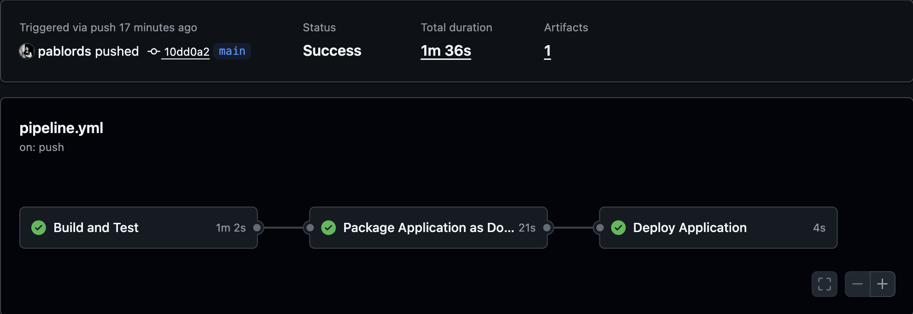

# meli-item-details-api

API de detalhes de item (estilo MELI) para página de produto: detalhes e recomendações. Projeto em Java 17, Spring Boot 3.4, arquitetura hexagonal, armazenamento em JSON e testes.

## Stack
- Java 17
- Spring Boot 3.4
- Armazenamento: arquivos JSON (`data/products.json`, `data/sellers.json`, `data/reviews.json`)
- Documentação: OpenAPI/Swagger
- Cache: Caffeine (TTL configurável)

## Arquitetura
Hexagonal (Ports & Adapters):
- **domain**: entidades, value objects, portas
- **application/service**: serviços responsáveis pela lógica de negócio
- **adapters**: implementação das portas de entrada e saída
- **config**: configuração de beans spring e open-api 

## Endpoints principais
- `GET /api/v1/products/{id}` — Detalhe do produto (inclui seller)
- `GET /api/v1/products/{id}/recommendations?limit=6` — Recomendações por categoria/marca
- `GET /api/v1/reviews/products/MLB001?sort=recent&limit=5&offset=5` - Reviews por produto
- `GET /actuator/health` — Health check

## Dados e índices
- Persistência via JSON
- Índices em memória: categoria, marca

## Recomendações
- Heurística: mesma categoria/marca, exclui o próprio item
- Limite configurável

## Cache
- Detalhe por ID cacheado via Caffeine (TTL)
- Índices evitam varredura O(n)

## Testes

### Estratégia de testes
Separação clara por propósito e velocidade. Cada perfil Maven ativa somente o escopo relevante.

#### Testes unitários
Focam em serviços e lógica de domínio isolada de transporte (HTTP) e persistência.
Executar:
```
mvn test -Punit-test
```
Características:
- Rápidos, sem subir contexto completo do Spring.
- Validam regras de negócio e transformação de dados.

#### Testes de componente
Validam a pilha HTTP/API passando pelos serviços e repositórios, mas com dependências/infra simuladas ou mockadas.
Executar:
```
mvn test -Pcomponent-test
```
Características:
- Usa MockMvc (ou similar) para chamadas de endpoint.
- Garante contratos básicos e serialização.

#### Testes de integração
Validam a aplicação “conectada”: controllers → serviços → repositórios → fontes reais de dados (arquivos JSON) e qualquer interação externa configurada.
Executar:
```
mvn test -Pintegration-test
```
Características:
- Sobe (quase) todo o contexto Spring.
- Assegura wiring correto e comportamento end-to-end.

### Convenções
- Perfis em `application-*-test.yml` ajustam configurações específicas.
- Nomes de classes: `*UnitTest`, `*ComponentTest`, `*IntegrationTest`.

## ADRs
Decisões arquiteturais documentadas em `docs/ADR-00X.md`.

## Estrutura de pastas
```
itemdetail
├── Application.java
├── adapters
│   ├── inbound
│   │   └── http
│   │       ├── controller
│   │       │   ├── ProductController.java
│   │       │   ├── ProductSwagger.java
│   │       │   ├── ReviewController.java
│   │       │   └── ReviewSwagger.java
│   │       ├── dto
│   │       │   ├── PriceResponseDTO.java
│   │       │   ├── ProductResponseDTO.java
│   │       │   ├── RecommendationResponseDTO.java
│   │       │   ├── ReviewResponseDTO.java
│   │       │   └── SellerResponseDTO.java
│   │       └── handler
│   │           ├── ApiErrorBuilder.java
│   │           ├── ApiErrorDTO.java
│   │           ├── ExceptionStatusMapper.java
│   │           └── GlobalExceptionHandler.java
│   └── outbound
│       └── file
│           ├── FileProductRepositoryAdapter.java
│           └── FileReviewRepositoryAdapter.java
├── config
│   ├── AppConfig.java
│   └── SwaggerConfig.java
└── domain
    ├── application
    │   ├── exception
    │   │   └── NotFoundException.java
    │   ├── ports
    │   │   └── inbound
    │   │       └── service
    │   │           ├── ProductServicePort.java
    │   │           └── ReviewServicePort.java
    │   └── service
    │       ├── ProductService.java
    │       └── ReviewService.java
    ├── entity
    │   ├── Product.java
    │   └── Review.java
    ├── ports
    │   └── outbound
    │       └── repository
    │           ├── ProductRepositoryPort.java
    │           └── ReviewRepositoryPort.java
    └── valueobject
        ├── Money.java
        ├── Paged.java
        ├── ProductWithSeller.java
        ├── RatingSummary.java
        ├── ReviewSort.java
        └── Seller.java

```

## Como rodar local
1. Requisitos: Java 17, Maven
2. Build: `./mvnw clean package`
3. Rodar: 
  - Local com maven`./mvnw spring-boot:run` 
  - Docker com live-reload (`docker-compose up meli-item-details-api-dev`)
    - Antes é necessário rodar `chmod +x .docker/docker_run_hot_reload.sh`
  - Docker sem live-reload (`docker-compose up meli-item-details-api`)
4. Acessar Swagger: [http://localhost:8080/api/v1/swagger-ui/index.html](http://localhost:8080/api/v1/swagger-ui/index.html)


  ## CI/CD Pipeline
  Pipeline automatizado em GitHub Actions (arquivo: `.github/workflows/pipeline.yml`) executado em:
  - Push na branch `main`
  - Pull Requests (opened, synchronize, reopened)

  

  ### Jobs
  1. build (Build and Test)
    - Checkout do código
    - Setup Java 17 (Temurin)
    - Cache de dependências Maven
    - Deriva versão do projeto (output `VERSION`)
    - Build sem testes (`mvn clean package -DskipTests`)
    - Testes unitários (`mvn test -Punit-test`)
    - Testes de componentes (`mvn test -Pcomponent-test`)
    - Testes de integração (`mvn test -Pintegration-test`)
    - Upload do artefato JAR gerado (`actions/upload-artifact`)

  2. package (Package Application as Docker Image)
    - Baixa artefato gerado pela job build
    - Login no Docker Hub usando secrets (`DOCKER_USERNAME` / `DOCKER_PASSWORD`)
    - Build da imagem Docker com tag `$DOCKER_REPO/meli-item-details-api:${VERSION}`
    - Push da imagem para o repositório

  3. deploy (Deploy Application)
    - Placeholder para comandos reais (ex.: kubectl, helm, terraform)
    - Hoje imprime mensagem; serve como gancho para futura automação

  ### Variáveis / Secrets
  - `DOCKER_REPO`: namespace de publicação (env global)
  - `DOCKER_USERNAME` / `DOCKER_PASSWORD`: autenticação no registry


